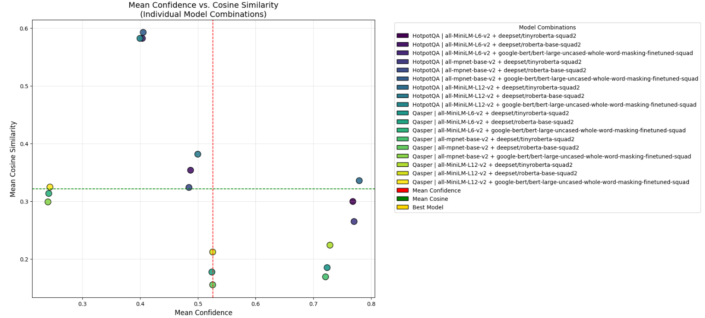
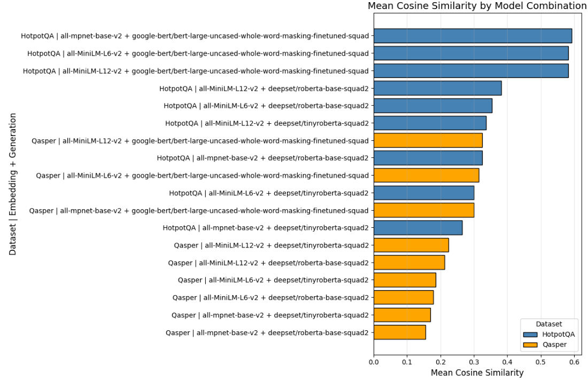

# QA Pipeline - Milestone 1

### 1. Objective and Pipeline Overview  

The objective of this project is to design and evaluate a machine learning pipeline for question answering (QA) over scientific and encyclopedic documents. The pipeline integrates data ingestion, embedding-based retrieval, reranking, and answer generation into a unified framework. Two benchmark datasets are used: **QASPER**, consisting of scientific research papers and associated questions, and **HotpotQA**, consisting of Wikipedia-based multi-hop reasoning questions.  

The end-to-end workflow is deployed across two Jupyter notebooks, executed within a Docker container. The first notebook handles **data ingestion and storage into ChromaDB**, while the second notebook performs **retrieval, answer generation, and assertion-based evaluation**.  

---

### 2. Architecture  

The pipeline is modular, with distinct components for datasets, embedding models, reranking models, and QA models.  

**Datasets.**  
- **QASPER**: Research-paper-based dataset with annotated QA pairs.  
- **HotpotQA**: Wikipedia-based multi-hop QA dataset.  

**Embeddings.**  
- **all-MiniLM-L6-v2**  
- **all-MiniLM-L12-v2**  
- **all-mpnet-base-v2**  
These models generate dense vector representations of text passages for storage and retrieval in ChromaDB.  

**Reranking.**  
- **cross-encoder/ms-marco-MiniLM-L-6-v2**: Applied to refine retrieved passages, ensuring higher contextual relevance for downstream QA models.  

**Question Answering Models.**  
- **google-bert/bert-large-uncased-whole-word-masking-finetuned-squad**  
- **deepset/tinyroberta-squad2**  
- **deepset/roberta-base-squad2**  

**Pipeline Configurations.**  
A configuration is defined as a unique combination of dataset, embedding model, and QA model (with a fixed reranker). This results in:  

- 2 datasets  
- 3 embedding models  
- 1 reranker  
- 3 QA models  

Total = **18 pipeline configurations**.

---

### 3. Results  

Instead of tabular SLA benchmarks (which remain pending), this milestone focuses on exploratory evaluation using **mean confidence** and **cosine similarity** metrics across model configurations.  

#### 3.1 Mean Confidence vs. Cosine Similarity  

**Image credit: Deshan.** The first figure plots the mean confidence of each QA model against the mean cosine similarity of its outputs. Each point represents a dataset–embedding–generation model configuration. The vertical (red) and horizontal (green) dashed lines mark the global averages for confidence and cosine similarity, respectively. This visualization allows us to quickly identify models that exceed baseline expectations.  

  

#### 3.2 Mean Cosine Similarity by Model Combination  

**Image credit: Deshan.** The second figure reports mean cosine similarity scores per dataset and model configuration. Configurations are ranked from highest to lowest similarity, and bars are color-coded by dataset (blue = HotpotQA, orange = QASPER). The results suggest that **HotpotQA generally achieves higher cosine similarity scores than QASPER**, with the top-performing configurations combining HotpotQA with `google-bert/bert-large-uncased-whole-word-masking-finetuned-squad`.  

  

#### 3.3 Observations  

- **Dataset sensitivity:** HotpotQA configurations consistently outperform QASPER in cosine similarity.  
- **Model performance:** The `google-bert/bert-large-uncased-whole-word-masking-finetuned-squad` model emerges as the strongest QA generator across both datasets.  
- **Trade-offs:** While confidence and similarity often correlate, some models achieve high confidence without high semantic similarity, highlighting the need for balanced evaluation criteria.  

SLA-based reporting on accuracy, latency, and compliance will be incorporated once benchmarks are published.  

---

### 4. Team Organization  

The team collaborates primarily via a shared **Discord channel**, which supports rapid communication and iteration. Responsibilities are divided as follows:  

- **Data Ingestion (load_dataset.ipynb):** drafted primarily by Deshan, focusing on acquisition, preprocessing, and ChromaDB ingestion.  
- **Model Integration (load_models.ipynb):** drafted primarily by Nagarjuna, focusing on retrieval, reranking, and QA model integration.  
- **Pipeline Integration and Documentation:** led by Katelyn, responsible for unifying both components, cleaning and documenting the pipeline, and reporting metrics. Plans include hosting the pipeline on AWS to enable scalable deployment and external evaluation.  

No major teamwork challenges have arisen. To strengthen collaboration in future milestones, the team intends to:  
- Use GitHub for clearer version control and issue tracking.  
- Define explicit deadlines for metric reporting and SLA validation.  
- Maintain Discord as the main communication channel, supplemented by structured weekly check-ins.  

---

### 5. Conclusion  

The pipeline integrates multiple QA models across two datasets in a modular architecture, yielding six total configurations. Results will be benchmarked on accuracy, latency, and SLA compliance once metrics are available. The team’s division of labor and collaborative workflow have supported efficient development, with plans to extend evaluation and deployment in future milestones.  